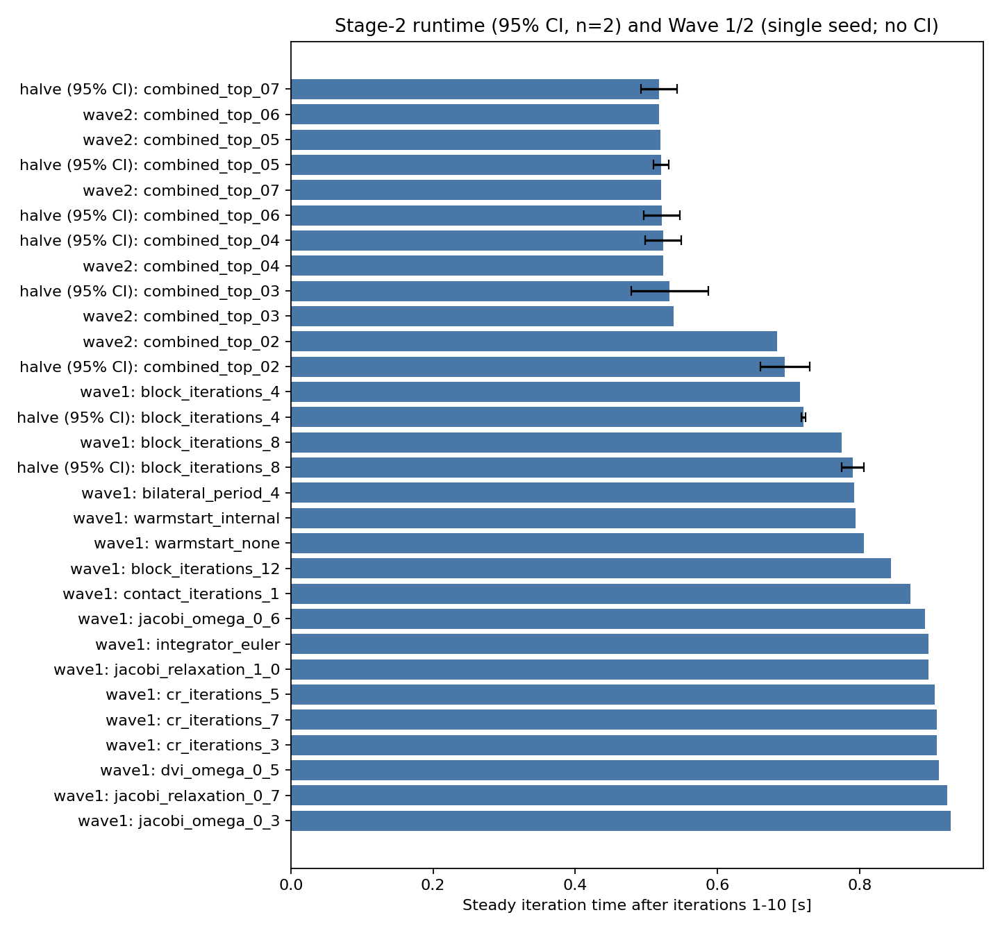
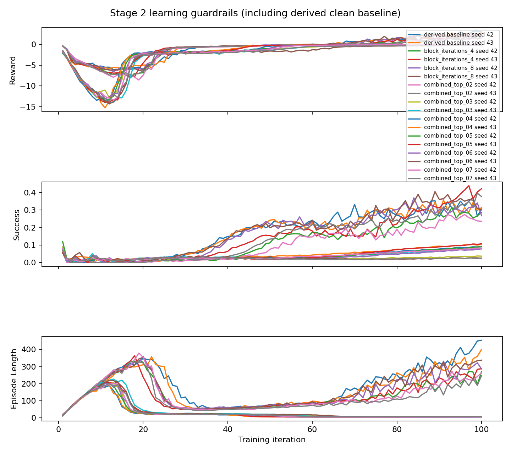

# ANYmal-D Kamino DVI Tuning

**Outcome: stopped with no safe finalist.** No Stage-2 candidate satisfied every per-seed learning guardrail. The ANYmal-D preset was not modified; final and canonical runs were skipped. No winner or winner speedup is reported.
Stage-2 metrics use two-sided 95% Student-t confidence intervals with n=2. Wave 1/2 rankings are single-seed observations without confidence intervals. Runtime excludes iterations 1--10; reward, TensorBoard `Metrics/success_rate`, and episode length use the final 20 iterations.

## Early-stop decision

- Candidate: `None`
- Environments: 4096
- Resolved configuration: `null`
- Canonical comparison: `null`
- Terminal status: `stopped_no_safe_finalist`
- Stop reason: No Stage-2 candidate satisfied every per-seed learning guardrail.

## Stage funnel

| Stage | Attempted runs | Valid runs | Terminal-rejected runs | Learning-rejected candidates | Promoted candidates |
|---|---:|---:|---:|---:|---:|
| baseline | 3 | 3 | 0 | 0 | 1 |
| Wave 1 | 18 | 16 | 2 | 0 | 6 |
| Wave 2 | 6 | 6 | 0 | 0 | 6 |
| halve | 16 | 16 | 0 | 8 | 0 |
| final | 0 | 0 | 0 | 0 | 0 |
| canonical | 0 | 0 | 0 | 0 | 0 |

Stage 2 also selected 2 candidate(s) that originated in Wave 1; these are not counted as Wave 2 promotions.

## Stage-2 metrics (95% CIs)

| Candidate | Runtime [s] | Reward | Success | Episode length |
|---|---:|---:|---:|---:|
| block_iterations_4 | 0.721 ± 0.003 (95% CI, n=2) | 1.438 ± 2.045 (95% CI, n=2) | 0.299 ± 0.515 (95% CI, n=2) | 215.532 ± 40.870 (95% CI, n=2) |
| block_iterations_8 | 0.790 ± 0.016 (95% CI, n=2) | 1.931 ± 2.311 (95% CI, n=2) | 0.329 ± 0.269 (95% CI, n=2) | 272.632 ± 162.550 (95% CI, n=2) |
| combined_top_02 | 0.695 ± 0.035 (95% CI, n=2) | 1.015 ± 0.240 (95% CI, n=2) | 0.261 ± 0.457 (95% CI, n=2) | 183.855 ± 201.358 (95% CI, n=2) |
| combined_top_03 | 0.533 ± 0.054 (95% CI, n=2) | -0.212 ± 1.105 (95% CI, n=2) | 0.050 ± 0.239 (95% CI, n=2) | 6.531 ± 19.583 (95% CI, n=2) |
| combined_top_04 | 0.524 ± 0.025 (95% CI, n=2) | -0.100 ± 0.037 (95% CI, n=2) | 0.085 ± 0.087 (95% CI, n=2) | 5.353 ± 3.501 (95% CI, n=2) |
| combined_top_05 | 0.521 ± 0.011 (95% CI, n=2) | -0.102 ± 0.099 (95% CI, n=2) | 0.083 ± 0.098 (95% CI, n=2) | 5.538 ± 4.320 (95% CI, n=2) |
| combined_top_06 | 0.521 ± 0.025 (95% CI, n=2) | -0.216 ± 1.281 (95% CI, n=2) | 0.043 ± 0.260 (95% CI, n=2) | 5.747 ± 11.683 (95% CI, n=2) |
| combined_top_07 | 0.517 ± 0.025 (95% CI, n=2) | -0.204 ± 1.170 (95% CI, n=2) | 0.047 ± 0.299 (95% CI, n=2) | 5.713 ± 11.293 (95% CI, n=2) |

## Contextual legacy runtimes

| Backend | Runtime [s] | Comparison status |
|---|---:|---|
| mjwarp | 0.370925 | contextual only |
| physx | 0.479481 | contextual only |

No apples-to-apples winner speedup is available because no candidate passed Stage 2.

## Stability, failures, and rejections

- block_iterations_4: seed 42: reward below 80% of baseline
- block_iterations_8: seed 42: episode length ratio outside [0.8, 1.2]
- combined_top_02: seed 42: reward below 80% of baseline
- combined_top_03: seed 42: reward below 80% of baseline
- combined_top_04: seed 42: reward below 80% of baseline
- combined_top_05: seed 42: reward below 80% of baseline
- combined_top_06: seed 42: reward below 80% of baseline
- combined_top_07: seed 42: reward below 80% of baseline
- contact_block_preconditioner_true: preflight:numerical
- dynamics_preconditioning_true: preflight:crash
- preflight__contact_block_preconditioner_true__seed42__env4096__iter5__attempt0: preflight:numerical
- preflight__dynamics_preconditioning_true__seed42__env4096__iter5__attempt0: preflight:crash

## Methodology and provenance

- Environment and coverage: 4096 environments; baseline seeds 42--44 at 300 iterations; Wave 1/2 seed 42 at 40; halve seeds 42--43 at 100; final and canonical skipped (zero attempts)
- Stage 2 baseline: first 100 aligned iterations of clean 300-iteration baseline; final-20 is iterations 81--100; source manifest/event/config hashes are retained in finalists.json
- Broad bundle dirty flags: 41; run IDs: baseline__baseline__seed42__env4096__iter300__attempt0, baseline__baseline__seed43__env4096__iter300__attempt0, baseline__baseline__seed44__env4096__iter300__attempt0, halve__block_iterations_4__seed42__env4096__iter100__attempt0, halve__block_iterations_4__seed43__env4096__iter100__attempt0, halve__block_iterations_8__seed42__env4096__iter100__attempt0, halve__block_iterations_8__seed43__env4096__iter100__attempt0, halve__combined_top_02__seed42__env4096__iter100__attempt0, halve__combined_top_02__seed43__env4096__iter100__attempt0, halve__combined_top_03__seed42__env4096__iter100__attempt0, halve__combined_top_03__seed43__env4096__iter100__attempt0, halve__combined_top_04__seed42__env4096__iter100__attempt0, halve__combined_top_04__seed43__env4096__iter100__attempt0, halve__combined_top_05__seed42__env4096__iter100__attempt0, halve__combined_top_05__seed43__env4096__iter100__attempt0, halve__combined_top_06__seed42__env4096__iter100__attempt0, halve__combined_top_06__seed43__env4096__iter100__attempt0, halve__combined_top_07__seed42__env4096__iter100__attempt0, halve__combined_top_07__seed43__env4096__iter100__attempt0, wave1__bilateral_period_4__seed42__env4096__iter40__attempt0, wave1__block_iterations_12__seed42__env4096__iter40__attempt0, wave1__block_iterations_4__seed42__env4096__iter40__attempt0, wave1__block_iterations_8__seed42__env4096__iter40__attempt0, wave1__contact_iterations_1__seed42__env4096__iter40__attempt0, wave1__cr_iterations_3__seed42__env4096__iter40__attempt0, wave1__cr_iterations_5__seed42__env4096__iter40__attempt0, wave1__cr_iterations_7__seed42__env4096__iter40__attempt0, wave1__dvi_omega_0_5__seed42__env4096__iter40__attempt0, wave1__integrator_euler__seed42__env4096__iter40__attempt0, wave1__jacobi_omega_0_3__seed42__env4096__iter40__attempt0, wave1__jacobi_omega_0_6__seed42__env4096__iter40__attempt0, wave1__jacobi_relaxation_0_7__seed42__env4096__iter40__attempt0, wave1__jacobi_relaxation_1_0__seed42__env4096__iter40__attempt0, wave1__warmstart_internal__seed42__env4096__iter40__attempt0, wave1__warmstart_none__seed42__env4096__iter40__attempt0, wave2__combined_top_02__seed42__env4096__iter40__attempt0, wave2__combined_top_03__seed42__env4096__iter40__attempt0, wave2__combined_top_04__seed42__env4096__iter40__attempt0, wave2__combined_top_05__seed42__env4096__iter40__attempt0, wave2__combined_top_06__seed42__env4096__iter40__attempt0, wave2__combined_top_07__seed42__env4096__iter40__attempt0
- Bundle dirty advisory: Broad/advisory bundle flag from plain `git status --porcelain`, which includes untracked paths; the runner separately enforced tracked-only cleanliness before launch. A true flag does not prove that only untracked paths differed.
- Derived preflight rejections: 2; sources: preflight__contact_block_preconditioner_true__seed42__env4096__iter5__attempt0 (preflight:numerical), preflight__dynamics_preconditioning_true__seed42__env4096__iter5__attempt0 (preflight:crash)
- Failed exact seed-42 screening preflights are projected in memory as rejected Wave 1/2 records only when measured evidence is absent; measured evidence always wins.
- Legacy comparison limitation: MJWarp/PhysX values come from the existing five-variant campaign whose manifests lack current exact source-HEAD and retained TensorBoard-event hashes; values are contextual only and no winner speedup is claimed.

## Figures

