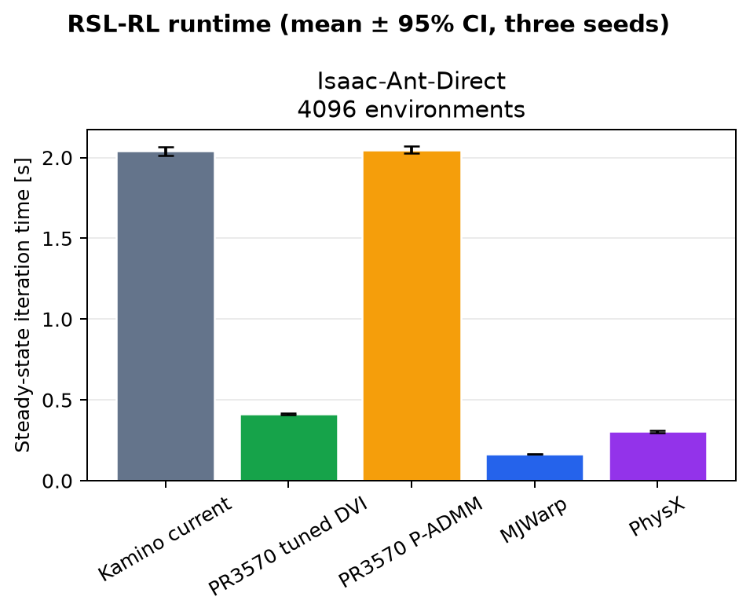
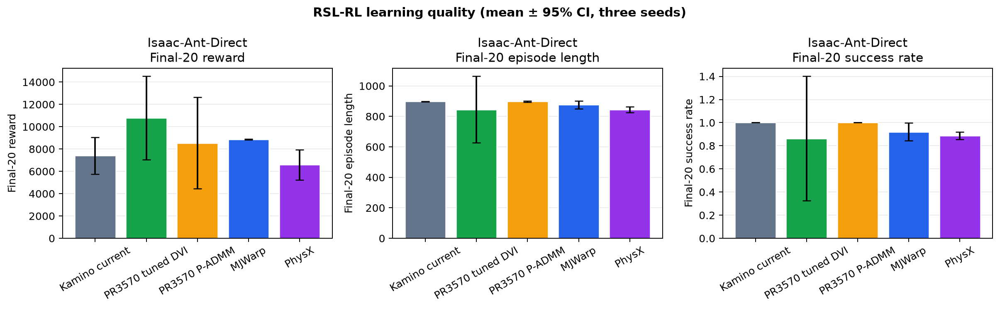

# Kamino DVI Solver Benchmark

RSL-RL training benchmark; values are three-seed means ± two-sided 95% Student-t confidence intervals.
Steady-state runtime excludes iterations 1–10; learning metrics average the final 20 iterations.

## Key findings

- Isaac-Ant-Direct: tuned DVI is 4.9× faster than current Kamino and 5.0× faster than PR3570 P-ADMM.
- Isaac-Ant-Direct: tuned DVI remains 2.5× slower than MJWarp and 1.4× slower than PhysX.

## Summary

| Task | Variant | Envs | Iteration time [s] | Total FPS | Reward | Episode length | Success rate |
|---|---|---:|---:|---:|---:|---:|---:|
| Isaac-Ant-Direct | Kamino current | 4096 | 2.040 ± 0.028 | 64263 ± 890 | 7402.741 ± 1650.401 | 898.716 ± 1.169 | 1.000 ± 0.000 |
| Isaac-Ant-Direct | PR3570 tuned DVI | 4096 | 0.413 ± 0.005 | 317194 ± 3709 | 10785.473 ± 3745.488 | 845.261 ± 218.999 | 0.863 ± 0.539 |
| Isaac-Ant-Direct | PR3570 P-ADMM | 4096 | 2.048 ± 0.023 | 63990 ± 722 | 8547.088 ± 4094.777 | 897.738 ± 3.259 | 1.000 ± 0.000 |
| Isaac-Ant-Direct | MJWarp | 4096 | 0.167 ± 0.001 | 785924 ± 4857 | 8872.347 ± 33.530 | 876.501 ± 25.822 | 0.921 ± 0.075 |
| Isaac-Ant-Direct | PhysX | 4096 | 0.304 ± 0.007 | 433084 ± 9769 | 6588.875 ± 1341.016 | 845.561 ± 18.860 | 0.888 ± 0.032 |

## Data quality and failures

- Schema v1.1 success series differs from TensorBoard in 15 of 15 runs; report uses TensorBoard success. This is the known generator bug addressed separately in PR 6624.
- Isaac-Ant-Direct tuned DVI success is seed-sensitive: the three-seed 95% CI half-width is 0.539.

## Figures

## Protocol

- RSL-RL, 300 training iterations, seeds 42–44.
- A common environment count is selected per task from 4096 downward only after explicit capacity failures.
- Runs are sequential on one GPU and validated against immutable IsaacLab/Newton revisions and schema v1.1.
- Reward and episode length use schema series; success rate uses the matching TensorBoard trace.
